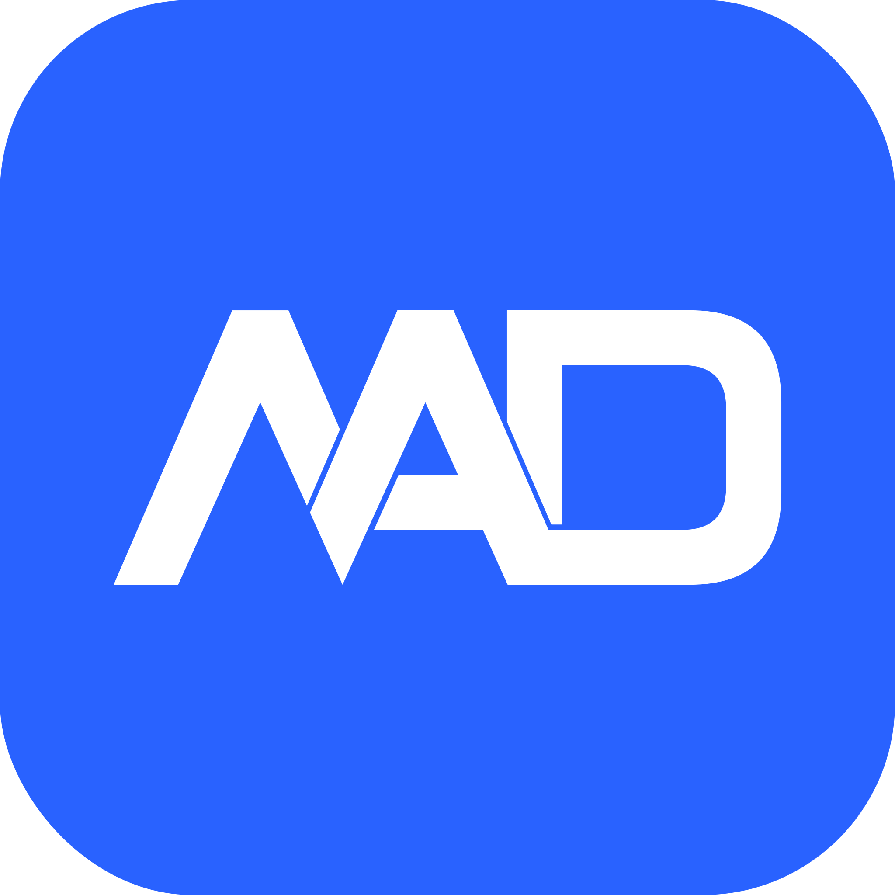

# Maaldocom.Services

[](https://github.com/mateasdorinko/maaldocom-services/actions/workflows/ci-cd.yml)
[](https://sonarcloud.io/summary/new_code?id=mateasdorinko_maaldocom-services)

[](https://github.com/mateasdorinko/maaldocom-services/actions/workflows/deploy-test.yml)
[](https://github.com/mateasdorinko/maaldocom-services/actions/workflows/deploy-prod.yml)

## Projects

### Src

- [MaaldoCom.Services.Api (Presentation)](src/MaaldoCom.Services.Api/README.md)
- [MaaldoCom.Services.Application](src/MaaldoCom.Services.Application/README.md)
- [MaaldoCom.Services.Cli](src/MaaldoCom.Services.Cli/README.md)
- [MaaldoCom.Services.Domain](src/MaaldoCom.Services.Domain/README.md)
- [MaaldoCom.Services.Infrastructure](src/MaaldoCom.Services.Infrastructure/README.md)

### Tests

- [Tests.Integration](tests/Tests.Integration/README.md)
- [Tests.Unit.Api](tests/Tests.Unit.Api/README.md)
- [Tests.Unit.Application](tests/Tests.Unit.Application/README.md)
- [Tests.Unit.Cli](tests/Tests.Unit.Cli/README.md)
- [Tests.Unit.Domain](tests/Tests.Unit.Domain/README.md)
- [Tests.Unit.Infrastructure](tests/Tests.Unit.Infrastructure/README.md)

## Solution Overview/Design

The solution is designed using Clean Architecture principles, separating concerns into distinct layers: Domain,
Application, Infrastructure, and API (Presentation). This structure promotes maintainability, testability, and
scalability. The Domain layer contains the core business logic and entities, while the Application layer handles use
cases and orchestrates interactions between the Domain and Infrastructure layers. The Infrastructure layer manages
data access, external services, and other technical concerns. The API layer serves as the entry point for client
interactions, exposing endpoints and handling requests.


The front-end application [maaldocom-web](https://github.com/mateasdorinko/maaldocom-web) is a separate repository and
is not included in this solution. It interacts with the API layer to provide a user interface for end-users.

## Solution Setup

### Docker Compose

#### SQL Server

Create both the docker-compose and .env files on your machine. Replace the `MY_SUPER_SECRET_PASSWORD` token with a
strong password in the .env file.

_docker-compose.yml_

```yaml
services:
  sqlserver2022:
    image: mcr.microsoft.com/mssql/server:2022-latest
    container_name: sqlserver2022
    environment:
      ACCEPT_EULA: Y
      MSSQL_SA_PASSWORD: ${MSSQL_SA_PASSWORD}
      MSSQL_PID: Developer # Developer edition
    ports:
      - "1433:1433"
    volumes:
      - data:/var/opt/mssql
    restart: unless-stopped

volumes:
  data:
```

_.env_

```yaml
MSSQL_SA_PASSWORD="MY_SUPER_SECRET_PASSWORD"
```

#### Azurite

_docker-compose.yml_

```yaml
services:
  azurite-emulator:
    image: mcr.microsoft.com/azure-storage/azurite
    container_name: azurite-emulator
    restart: unless-stopped
    command: "azurite --blobHost 0.0.0.0 --queueHost 0.0.0.0 --tableHost 0.0.0.0 --location /data --debug /data/debug.log --skipApiVersionCheck --loose"
    ports:
      - "10000:10000" # blob storage service
      - "10001:10001" # queue storage service
      - "10002:10002" # table storage service
    volumes:
      - data:/data

volumes:
  data:
```

### Other Setup

- [Local User Secrets](src/MaaldoCom.Services.Api/README.md#local-user-secrets)
- [Entity Framework](src/MaaldoCom.Services.Infrastructure/README.md#entity-framework)
- [FFMpeg](src/MaaldoCom.Services.Infrastructure/README.md#ffmpeg)

## MicroK8s Support

I'm working on adding support for a MicroK8s deployment running on a Raspberry Pi cluster. Will document this as I go.

### Setup

#### Azure Edge SQL Database

```yaml
services:
    sqledge:
    image: mcr.microsoft.com/azure-sql-edge:latest
    container_name: sqledge
    environment:
      ACCEPT_EULA: Y
      MSSQL_SA_PASSWORD: ${MSSQL_SA_PASSWORD}
      MSSQL_PID: Developer # Developer edition
    ports:
      - "1433:1433"
    volumes:
      - data:/var/opt/mssql
    restart: unless-stopped

volumes:
  data:
```

_.env_

```yaml
MSSQL_SA_PASSWORD="MY_SUPER_SECRET_PASSWORD"
```

